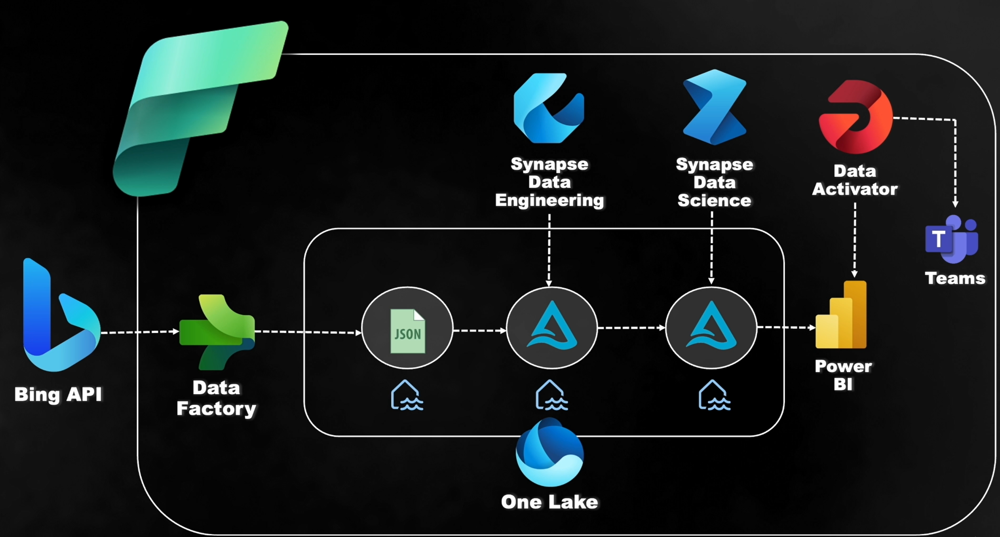
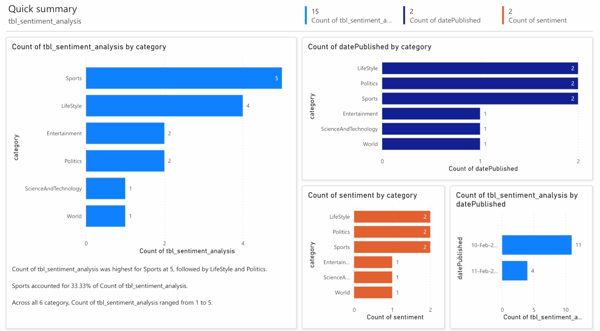
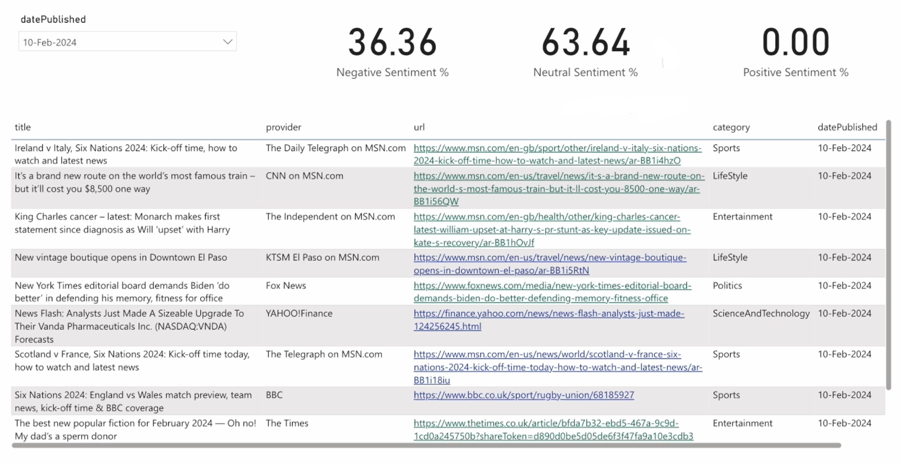
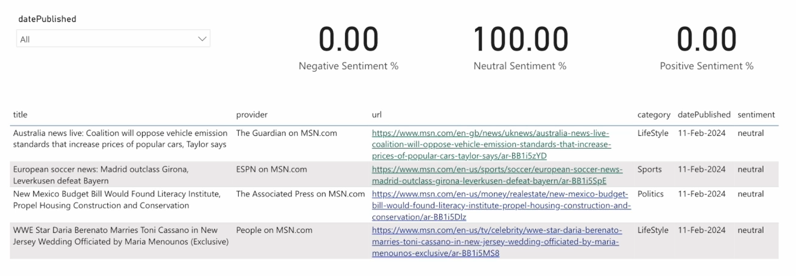

# News Sentiment Analysis Pipeline with Microsoft Fabric

## Project Summary

This project demonstrates an end-to-end data pipeline that analyzes news sentiment from Bing API using Microsoft Fabric's integrated suite of services. The pipeline processes news articles, performs sentiment analysis, and delivers insights through Power BI dashboards, with automated alerting through Teams.

### Key Features

- **Real-time News Analysis**: Ingests and processes news data from Bing API
- **Sentiment Analysis**: Evaluates the sentiment of news articles across different categories
- **Interactive Dashboards**: Visualizes sentiment trends and metrics through Power BI
- **Automated Alerting**: Configures alerts for significant sentiment changes via Teams

## Detailed Architecture

The architecture leverages Microsoft Fabric's comprehensive suite of services to create a seamless data analytics pipeline:

1. **Bing API** serves as the data source, providing a continuous stream of news articles across various categories.

2. **Data Factory** handles the orchestration of the entire pipeline:
   - Connects to the Bing API to extract news data
   - Manages the data flow between different components
   - Schedules and monitors pipeline execution

3. **One Lake** functions as the central data storage layer:
   - Stores raw JSON data from the Bing API
   - Hosts the processed data and delta tables
   - Provides a unified storage experience across the pipeline

4. **Synapse Data Engineering**:
   - Processes raw JSON data using Spark notebooks
   - Transforms unstructured data into structured formats
   - Creates and maintains delta tables for efficient querying

5. **Synapse Data Science**:
   - Applies text analytics to news content
   - Determines sentiment scores (positive, neutral, negative)
   - Categorizes and tags content for further analysis

6. **Power BI** delivers interactive visualizations:
   - Presents sentiment distribution across news categories
   - Shows trends in sentiment over time
   - Provides metrics on news providers and content types

7. **Data Activator**:
   - Monitors sentiment trends for significant changes
   - Triggers alerts based on predefined thresholds
   - Integrates with Microsoft Teams to deliver notifications

## Dashboard Metrics

The Power BI dashboard provides several key metrics:

- Count of articles by category (Sports, Politics, World, Entertainment, etc.)
- Sentiment distribution (Positive, Neutral, Negative)
- Provider analysis showing which news sources contribute most across categories
- Timeline views of sentiment changes

## Conclusion

This project demonstrates the power of Microsoft Fabric's integrated analytics platform for building end-to-end data solutions. By leveraging the full suite of Fabric services, I've created a comprehensive news sentiment analysis pipeline that processes data from ingestion to visualization with minimal friction between components.

The sentiment analysis capabilities provide valuable insights into news trends across different categories, helping users understand the emotional tone of current events. The integration with Microsoft Teams for alerts ensures that stakeholders are promptly informed of significant sentiment shifts.

This architecture showcases how modern data solutions can combine cloud services, AI capabilities, and business intelligence tools to deliver actionable insights from unstructured data sources.
